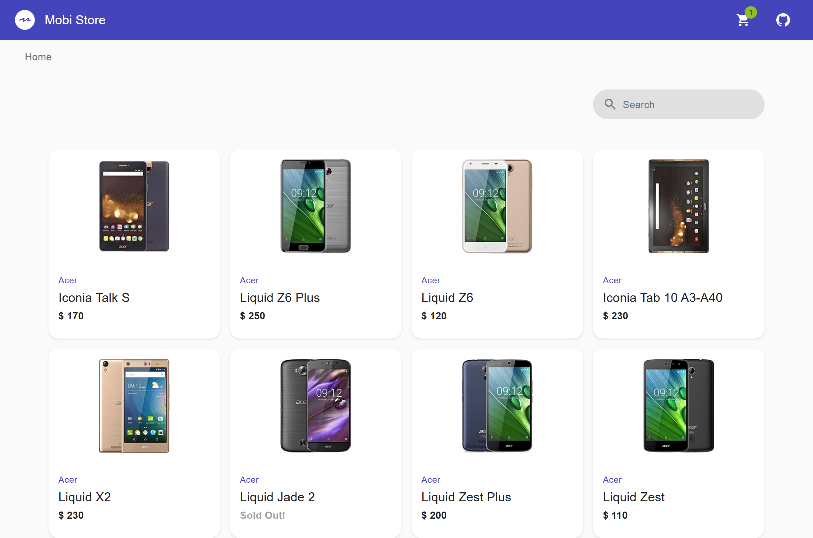

# 🛒 Mobi Store 

This repository contains a simple online store built using Preact.

## Screenshots



## Features

- Listing and Detailing items
- Cart management
- Responsive design

## Installation

1. Clone the repository:

   ```bash
   git clone https://github.com/jocammir/frontend_test.git
   ```

2. Navigate to the project directory:

   ```bash
   cd frontend_test
   ```

3. Install dependencies:

   ```bash
   npm install
   ```

4. Start the development server:

   ```bash
   npm run dev
   ```

5. Open your browser and visit [http://localhost:8080/](http://localhost:8080/) to view the app.

## Building

Build for production with minification

```bash
npm run build
```

Test the production build locally

```bash
npm run serve
```

## Testing

Run tests with Jest and Enzyme

```bash
npm run test
```

## Linting

To ensure code quality, you can run ESLint:

```bash
npm run lint
```


## License

This project is licensed under the [MIT License](LICENSE).
